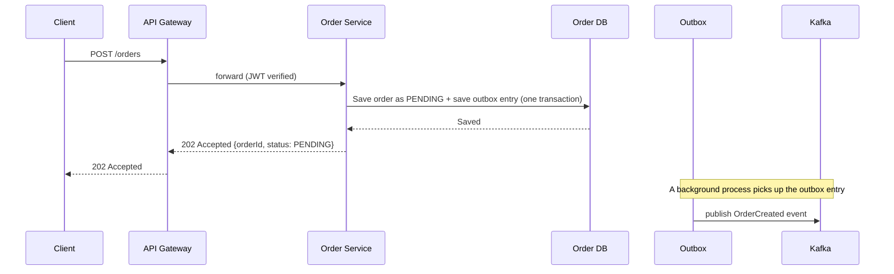
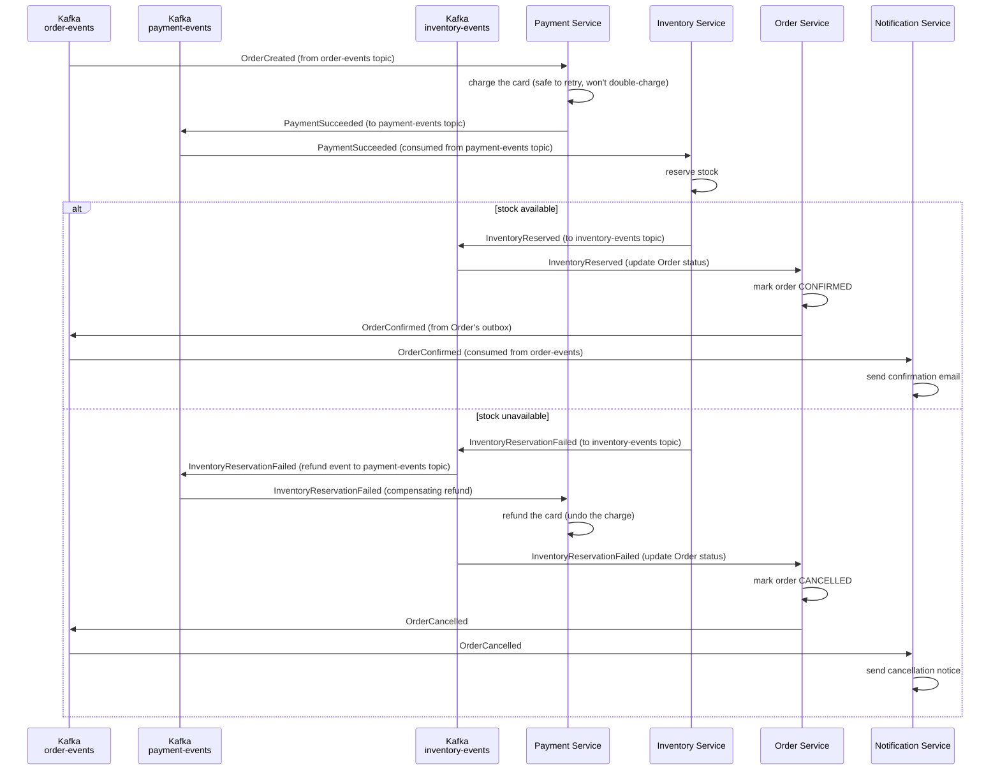

# Production-Ready Order Platform — System Design Document

**Scope:** Order Service, Payment Service, Inventory Service, Notification Service
**Infrastructure:** PostgreSQL, Redis, Kafka, AWS

---

## 1. Architecture Diagram

```
┌─────────────────────────────────────────────────────────────────────────────────┐
│                           CLIENT / MOBILE / WEB                                 │
└────────────────────────────────┬────────────────────────────────────────────────┘
                                 │
                    ┌────────────▼─────────────┐
                    │   API GATEWAY (NestJS)   │
                    │  JWT Validation          │
                    │  Rate Limiting           │
                    │  mTLS Validation         │
                    └────────────┬─────────────┘
                                 │
                    ┌────────────▼───────────────────────────┐
                    │      ORDER SERVICE (mTLS)              │
                    │ ┌──────────────────────────────────┐   │
                    │ │ REST API                         │   │
                    │ │ (create order, update status)    │   │
                    │ └────────┬─────────────────────────┘   │
                    │          │                             │
                    │ ┌────────▼────────┐  ┌────────────┐    │
                    │ │   Order DB      │  │  Outbox    │    │
                    │ │  (Postgres)     │  │   Table    │    │
                    │ └─────────────────┘  └──────┬─────┘    │
                    │                             │          │
                    │                      CDC/Relay         │
                    │                             │          │
                    └─────────────────────────────┼──────────┘
                                                  │
                            ┌─────────────────────┼─────────────────────┐
                            │                     │                     │
                    ┌───────▼───────┐    ┌───────▼───────┐    ┌───────▼────────┐
                    │  order-events │    │ payment-events│    │inventory-events│
                    │  (Kafka Topic)│    │ (Kafka Topic) │    │ (Kafka Topic)  │
                    └───────┬───────┘    └───────┬───────┘    └────────┬───────┘
                            │                    │                     │
        ┌───────────────────┼─────────────────┐  │                     │
        │                   │                 │  │                     │
┌───────▼────────┐  ┌───────▼────────┐  ┌─────▼──▼────────┐  ┌─────────▼───────┐
│ NOTIFICATION   │  │ PAYMENT        │  │  INVENTORY      │  │ BACKGROUND      │
│ SERVICE (mTLS) │  │ SERVICE (mTLS) │  │  SERVICE (mTLS) │  │ WORKER          │
│                │  │                │  │                 │  │                 │
│ Event Consumer │  │ REST/Event API │  │ Event Consumer  │  │ Job Queue       │
│                │  │                │  │                 │  │ (BullMQ/Kafka)  │
│ Notif Log DB   │  │ Payment DB     │  │ Inventory DB    │  │                 │
│ (Postgres)     │  │ (Postgres)     │  │ (Postgres)      │  │ Lambda/Compute  │
│                │  │                │  │                 │  │ (Separate)      │
│ Send emails,   │  │ Outbox Table   │  │ Outbox Table    │  │                 │
│ SMS, push      │  │ (publishes)    │  │ (publishes)     │  │ PDF generation  │
│                │  │ to Kafka       │  │ to Kafka        │  │ Data aggregation│
└────────────────┘  └────────────────┘  └─────────────────┘  └─────────────────┘
        │                   │                     │
        └───────────────────┴─────────────────────┘
                            │
                      ┌─────▼──────┐
                      │   REDIS    │
                      │            │
                      │ Cache      │
                      │ Idempotency│
                      │ Keys       │
                      │ Rate Limit │
                      └────────────┘

SECURITY LAYER:
  ├─ JWT Validation (API Gateway)
  ├─ JWT Token Relay (Internal JWT)
  ├─ mTLS (Service-to-Service)
  └─ AWS Secrets Manager (API Keys, Passwords)

OBSERVABILITY LAYER:
  ├─ OpenTelemetry (Instrumentation)
  ├─ Jaeger (Distributed Tracing)
  ├─ Prometheus (Metrics Collection)
  ├─ Grafana (Dashboards)
  ├─ Structured Logs (nestjs-pino, JSON)
  ├─ Correlation IDs (HTTP & Kafka headers)
  ├─ Loki (Log Aggregation)
  └─ Trace IDs (OpenTelemetry Spans)
```

**Key architectural decisions:**

- **Choreography, not orchestration** — each service reacts to events on its own instead of one "boss" service telling everyone what to do. This keeps services independent.
- **Transactional Outbox** in every service — guarantees events are published reliably without dual-write bugs.
- **Kafka with separate topics** — `order-events`, `payment-events`, `inventory-events` (not one bottleneck topic) so each service's stream scales independently.
- **Event-driven compensation** — when Inventory fails, it publishes an event; Payment reacts asynchronously. No synchronous API calls between services.
- **Background Worker** — CPU-intensive work (PDF generation, aggregation) runs separately so it never blocks the main request path.
- **mTLS + JWT** — JWT answers "who is this user?", mTLS answers "which service is calling?". Both are needed.
- **Observability everywhere** — OpenTelemetry tracing, Prometheus metrics, structured logs with Correlation IDs, so choreography (which is async and cross-service) remains debuggable.

_Visual reference:_ See **`order-platform-architecture.drawio`** (open at [draw.io](https://app.diagrams.net)) for a clean diagram of the main data flow.

---

## 2. Service Responsibility Table

| Service          | Owns             | Job                                                    | Does NOT touch             |
| ---------------- | ---------------- | ------------------------------------------------------ | -------------------------- |
| **Order**        | Order DB         | Create/cancel orders, hold the "official" order status | Payment info, stock counts |
| **Payment**      | Payment DB       | Charge/refund cards, tell everyone if payment worked   | Order status, inventory    |
| **Inventory**    | Inventory DB     | Reserve/release stock, prevent overselling             | Payment, order status      |
| **Notification** | Notification log | Send emails/SMS/push, track what was sent              | Any core business data     |

No service reads another service's database directly. If Order needs info that lives in Payment, it either asks Payment's API or keeps its own small local copy built from events it already receives.

---

## 3. NestJS Architecture

### 3.1 Module boundaries

Each service is its own separate NestJS app (not one big app split into folders). Inside each service, the code is organized in layers:

```
src/
  application/       <- the actual use cases, e.g. "create an order"
  domain/             <- core business rules, plain TypeScript, no framework code
  infrastructure/
    persistence/      <- talks to the database
    messaging/         <- talks to Kafka
    external/           <- talks to outside services (e.g. the card processor)
  interface/
    http/                <- controllers, request/response shapes
    events/              <- listens for incoming events
```

The point of this split: business rules (`domain/`) don't know or care whether data comes from Postgres or Kafka. If we swap Kafka for something else later, we only touch one folder.

### 3.2 Dependency Injection (DI) strategy

DI just means: instead of a class creating its own database connection or Kafka client, NestJS "hands it" whatever it needs. This makes testing easier (you can hand it a fake version instead) and makes it easy to swap pieces later.

- We define interfaces (contracts) like "OrderRepository" and wire the real database code to that contract. The business logic only knows the contract, not the database details.
- Most things are singletons (one shared instance). A few things — like tracking who's making the current request — are created fresh per request, but we keep this to a minimum since it has a small performance cost.
- Each service has its own self-contained modules, plus one small shared module for things every service needs (logging, config, request tracking).

### 3.3 RBAC vs ABAC — per service

RBAC = access based on your **role** ("admin," "customer," "staff"). ABAC = access based on **attributes/conditions** ("only if you're assigned to this region AND the amount is under $500").

| Service      | Model    | Roles                                 | Why                                                                                                                                                                                                                                     |
| ------------ | -------- | ------------------------------------- | --------------------------------------------------------------------------------------------------------------------------------------------------------------------------------------------------------------------------------------- |
| Order        | **RBAC** | `customer`, `support`, `admin`        | Just a few roles, and permissions map cleanly to them (customers manage their own orders, support can view/cancel any, admin has full access).                                                                                          |
| Payment      | **ABAC** | _(attribute-driven, not role-driven)_ | Rules are more complex — e.g., "a support agent can view a payment only for customers in their region," or "refunds above a limit need a second approver." Roles alone can't express that without creating a huge, messy list of roles. |
| Inventory    | **RBAC** | `staff`, `admin`                      | Internal-only service — `staff` (warehouse/ops) can view and adjust stock/reservations for day-to-day work, `admin` can additionally reconfigure thresholds or override reservations. Small, stable role set is enough.                 |
| Notification | **RBAC** | `staff`, `admin`                      | Same idea — internal-only, minimal access needed.                                                                                                                                                                                       |

In code: a simple `RolesGuard` + `@Roles('staff')` / `@Roles('admin')` decorator checks roles where RBAC is enough (Order, Inventory, Notification), and a slightly heavier `PolicyGuard` (using a rules library) handles the ABAC cases in Payment.

---

## 4. Main Request & Event Flow

### 4.1 Placing an order (the part the customer waits for)



The customer gets a quick "we've got your order" response right away — they don't sit there waiting for payment and stock checks to finish. Confirmation comes later (push notification, email, or polling).

### 4.2 What happens after (the part the customer doesn't wait for)



**Important note on compensation:**
When Inventory reservation fails, it publishes `InventoryReservationFailed` to the **inventory-events topic**. Payment Service subscribes to the **payment-events topic** (not inventory-events directly). The compensation path is: `InventoryReservationFailed` → published by Inventory → routed by a relay/router to **payment-events topic** → Payment Service consumes it and refunds.

This preserves **choreography's loose coupling principle** — no service makes direct synchronous API calls as part of the Saga; all communication is async via Kafka topics. This avoids the "two services tightly coupled by a sync refund call" trap.

---

## 5. Saga Pattern, Outbox, and Safe Retries

### 5.1 Choreography vs. orchestration — decision

**We picked choreography** — no single service is "in charge" of the whole flow. Each service just listens for events it cares about and reacts.

|                               | Choreography (our choice)                  | Orchestration                                         |
| ----------------------------- | ------------------------------------------ | ----------------------------------------------------- |
| How coupled are services?     | Loosely — they just agree on event formats | More tightly — one coordinator has to know every step |
| Single point of failure?      | No                                         | Yes — if the coordinator breaks, everything stalls    |
| Easy to follow what happened? | Harder without good tracing                | Easier — one place shows the whole flow               |
| Adding a new step later       | Easy — just listen for the event           | Requires changing the coordinator                     |

With only 4 services and a fairly straight-line flow, choreography's simplicity wins. We make up for the "harder to follow" downside with tracing and correlation IDs (§7). If the flow gets a lot more complicated later, switching to an orchestrator (like Temporal or AWS Step Functions) would be worth reconsidering.

### 5.1.5 Separate Kafka Topics (not a bottleneck)

A common mistake: dumping all events into one `all-events` topic. This causes:

- **Partition contention**: if Order Service produces 1000 events/sec and Payment produces 100 events/sec, a single topic's partitions can't be scaled independently — you're forced to pick a partition count that suits the largest producer, wasting resources on the smaller one
- **Consumer group confusion**: multiple independent consumer groups (Inventory consuming Payment events, Notification consuming everything) fight over partition offsets, complicating lag monitoring and recovery
- **Coupling at the data level**: semantically, order events are different from payment events (different schemas, different frequencies, different importance levels) — they shouldn't share a partition key

**Solution: Three Topics**

- `order-events` — OrderCreated, OrderConfirmed, OrderCancelled (Order Service → Outbox → order-events)
- `payment-events` — PaymentSucceeded, PaymentFailed, RefundIssued (Payment Service → Outbox → payment-events)
- `inventory-events` — InventoryReserved, InventoryReservationFailed (Inventory Service → Outbox → inventory-events)

**Consumer subscriptions:**

- Inventory subscribes only to `order-events` and `payment-events`, ignores others
- Notification subscribes only to `order-events` (for final confirmations) and `inventory-events` (for failures)
- Payment subscribes to `payment-events` (for compensation refunds triggered by inventory failures, if routed there via a relay)

This keeps each service's event stream independent, scalable, and semantically clean.

### 5.2 Transactional Outbox — how we avoid losing events

The problem: what if a service saves to its database, but crashes right before telling Kafka about it? Now the database and the rest of the system disagree.

The fix: save the database change **and** a note saying "please send this event" in the exact same database transaction:

```sql
BEGIN;
INSERT INTO orders (...) VALUES (...);
INSERT INTO outbox (id, aggregate_id, event_type, payload, created_at)
  VALUES (...);
COMMIT;
```

A separate small background process (reading the outbox table, or using a tool like Debezium) picks up these notes and actually sends them to Kafka, then marks them as sent. This way, the save and the "promise to notify others" either both happen or neither does — no gap where one succeeds and the other silently fails.

### 5.3 Handling duplicate messages safely (idempotency)

Because of how the Outbox works, an event might occasionally get sent more than once — that's fine as long as receiving it twice causes no harm. So:

- Every event carries a unique ID (UUID).
- Each service keeps a small record of "IDs I've already handled" (a database table, or a fast Redis check with TTL) and skips anything it's already processed.
- Where possible, effects are written so repeating them changes nothing (e.g., "set reservation status to X" instead of "add one more reservation").
- For actual card charges, we also use the payment provider's own duplicate-charge protection (keyed by order ID), as a second layer of safety on top of our own check.

### 5.4 Event-Driven Compensation (not direct API calls)

**Important pattern**: when a Saga step fails and we need to "undo" previous steps, the compensation must happen via events on Kafka, not via direct synchronous API calls between services.

**Wrong way (tight coupling):**

```
Inventory Service (on InventoryReservationFailed):
  POST http://payment-service/refund directly
```

This creates a synchronous dependency: if Payment Service is slow or down, the entire compensation chain stalls.

**Right way (loose coupling):**

```
Inventory Service (on reservation failure):
  1. Publishes InventoryReservationFailed to inventory-events topic
  2. (optionally) Also writes an event to payment-events topic OR
  3. A relay/router subscribes to inventory-events and republishes to payment-events

Payment Service:
  Subscribes to payment-events topic
  Sees RefundRequired event
  Issues refund asynchronously
```

This keeps compensation async and choreography-aligned — no service is blocked waiting for another to refund; all are just reacting to events in their queue.

---

---

## 6. Performance

### 6.1 Query optimization

- Add database indexes that match how we actually query the data (e.g., an index for "look up a customer's recent orders").
- Avoid the classic "N+1 queries" mistake (looping and querying once per item) by batching lookups together.
- For read-heavy screens (like checking order status), keep a simplified, pre-built copy of the data updated from the same events already flowing through the system, so we don't have to run a complex query every time.

### 6.2 Caching with Redis

| Layer               | What's cached                       | How long             | How it's kept fresh                                        |
| ------------------- | ----------------------------------- | -------------------- | ---------------------------------------------------------- |
| Order summaries     | Order info by ID                    | 30 sec               | Cleared when the order changes                             |
| Stock availability  | Can-I-buy-this-now check            | 5 sec                | Cleared when stock changes, plus a short timeout as backup |
| Duplicate-check IDs | Already-processed event/payment IDs | 24 hr                | Just expires naturally                                     |
| Rate limits         | Requests-per-user counters          | Short rolling window | Expires naturally                                          |

The rule: check Redis first, fall back to the real database if it's not there, and Redis is never treated as the "real" source of truth — the database always is.

### 6.3 Database connection pooling

Opening a new database connection is slow, so each service keeps a small pool of ready-to-use connections instead of opening a new one per request — roughly sized to the service's CPU count and tuned from real load testing. For services that might scale out a lot (many small instances), we put PgBouncer in front of Postgres so hundreds of app instances don't each try to hold their own big pool of direct connections.

We also watch pool usage as a metric — running out of free connections is a common, easy-to-miss cause of slow responses.

### 6.4 Background Worker — CPU-Intensive Tasks

Heavy CPU work (PDF generation, data aggregation) **must never run inline** on the main NestJS request path, because it:

- Blocks the event loop (Node.js is single-threaded), freezing all other requests
- Starves the connection pool — long-running requests hold DB connections hostage
- Makes latency unpredictable (p99 shoots up) when a spike of PDF requests arrives

**Architecture:**

- **Job Queue**: when Order Service needs a PDF generated, it writes a job to a queue (BullMQ on Redis, or a dedicated Kafka topic `document-jobs`)
- **API response**: the order creation returns immediately: `{orderId: "123", status: PENDING}` — the PDF generation is fully decoupled
- **Background Worker**: a separate service/Lambda function consumes from the job queue, generates the PDF, stores it (S3), and notifies the customer ("your invoice is ready") via Notification Service
- **Separate compute**: the worker runs on Lambda (scale to zero, provisioned concurrency for latency-sensitive PDFs) or a separate ECS service with its own capacity, so a spike in document generation can't starve the main Order/Payment API

**Specific tasks delegated to Background Worker:**

- Invoice/receipt PDF generation (triggered when order is confirmed)
- Daily/weekly sales aggregation reports (scheduled batch job, runs against a read-only database replica at off-peak times)
- Image resizing/processing (if product images are uploaded)
- Email template rendering with heavy data (e.g., detailed invoice with line-by-line tax breakdowns)

---

## 7. Security and Observability

### 7.1 Security design

- **JWT (JSON Web Token)**: a signed "ticket" proving who the logged-in user is. The API Gateway checks this ticket once, then issues its own short-lived internal ticket for the services to pass to each other — rather than forwarding the customer's original ticket everywhere.
- **mTLS between services**: on top of the ticket proving _who the user is_, mTLS lets services prove _which service_ is calling — similar to how HTTPS proves a website is legit, but here it's service-to-service. This stops an attacker who's somehow gotten onto the internal network from just replaying a stolen ticket.
- **Secrets** (API keys, DB passwords) are stored in AWS Secrets Manager and loaded at runtime — never hardcoded or committed to code.
- Who's allowed to do what is then handled by the RBAC/ABAC guards from §3.3.

### 7.1.5 Service-to-Service Authentication (mTLS)

Beyond JWT, which answers "who is this user?", we also need "which service is calling?". This is where **mutual TLS (mTLS)** comes in:

- **mTLS certificates** are issued to each service (Order, Payment, Inventory, Notification) by an internal CA (often provisioned via Kubernetes cert-manager or AWS secrets).
- When Service A calls Service B (e.g., via HTTP over TLS), both services validate each other's certificates before the connection is established.
- This means a compromised internal network can't just replay a stolen JWT — an attacker would also need the private certificate file, which is only loaded into the correct service's container at runtime.
- In Kubernetes, mTLS is transparent when using a service mesh like Istio; on plain ECS, it's implemented via NestJS TLS client/server config or AWS ALB with mutual authentication.

### 7.2 Observability strategy

#### 7.2.1 Structured Logging & Correlation IDs

- **Structured logs**: every log line is written as JSON (not plain text) via `nestjs-pino` or similar, and always includes:
  - `correlationId`: a UUID generated at the API Gateway and passed through every downstream HTTP header and Kafka message header
  - `traceId`: from OpenTelemetry tracing (see below), ties the log to the full trace
  - `orderId` (when applicable), `service`, `timestamp`, `level`, and the actual message
- **Correlation ID propagation**: the Gateway generates or reads an inbound `X-Correlation-Id` header and stamps it into every service-to-service HTTP call (via interceptors) and every Kafka message (via headers). This single ID lets you search logs across all four services: `grep correlationId=abc123 /var/log/order-service /var/log/payment-service ...` yields the entire order's lifecycle.
- **Log aggregation**: all JSON logs are shipped to **Loki** (a log aggregation system paired with Grafana), where they're queryable by any field (service, correlationId, orderId, error rate, etc.). Grafana dashboards query Loki: "show me logs from the last hour where error count > 0 grouped by service."

#### 7.2.2 Distributed Tracing (OpenTelemetry + Jaeger)

- **OpenTelemetry instrumentation**: each NestJS service auto-instruments HTTP endpoints, the Postgres driver (latency per query), the Kafka producer/consumer (latency per publish/consume), and Redis calls via `@opentelemetry/instrumentation-*` packages.
- **What gets traced**: every request creates a root span. When it calls another service, a child span is created for that HTTP call. When it publishes to Kafka, a span records publish latency. Nested spans form a complete waterfall, showing exactly where time is spent.
- **Export to Jaeger**: traces are exported (via the OpenTelemetry Collector) to Jaeger, which stores them and provides a UI to search by `traceId` or by service/operation/latency filters.
- **Finding problems**: "p99 latency is high" → open Jaeger, filter by duration > 500ms, see that 80% of slow traces have a slow Payment Service call, which shows a slow Postgres query in the span details.
- **Why this matters for choreography**: without distributed tracing, choreography feels opaque — you don't know where time went across the four services. With tracing, you get a complete waterfall view of the entire Order → Payment → Inventory → Order → Notification flow as one coherent trace, even though no single service "orchestrates" it.

#### 7.2.3 Metrics (Prometheus + Grafana)

- **Metrics collection**: each service exposes a `/metrics` endpoint (via `prom-client` or similar) that Prometheus scrapes every 15 seconds, collecting:
  - **Request metrics**: `http_requests_total` (rate), `http_request_duration_seconds` (latency), `http_requests_failed_total` (errors) — all tagged by endpoint, status code, service
  - **Event consumer metrics**: `kafka_messages_consumed_total`, `kafka_consumer_lag_seconds` (how far behind the consumer is), `event_processing_duration_seconds`
  - **Database metrics**: `db_queries_duration_seconds`, `db_connection_pool_active`, `db_connection_pool_max` (show pool utilization)
  - **Business metrics**: `orders_created_total`, `saga_compensations_total` (order failures), `outbox_unpublished_age_seconds` (how old the oldest unsent event is)
- **Grafana dashboards**: query Prometheus to build dashboards showing RED metrics (Rate, Errors, Duration) per service, plus business KPIs (orders/min, Saga failure %, outbox delay).

**What the Grafana dashboards show:**

| Panel                         | What it tracks                                  | When to alert                   |
| ----------------------------- | ----------------------------------------------- | ------------------------------- |
| Requests & errors             | Traffic and error rate                          | Error rate over 2% for 5 min    |
| Response time                 | p50/p95/p99 latency                             | p99 over 500ms for 5 min        |
| DB connections in use         | How full the connection pool is                 | Over 80% full                   |
| Outbox delay                  | How old the oldest unsent event is              | Over 30 sec                     |
| Kafka backlog                 | Unprocessed messages waiting per consumer       | Over 1000, or steadily growing  |
| Saga failure rate             | How often we have to "undo" an order            | Over 5%                         |
| Card processor latency/errors | How the external payment provider is performing | p95 over 2s, error rate over 1% |

---

## 8. Deployment Strategy

### 8.1 ECS vs. Lambda — matched to traffic pattern

| Component                          | Traffic pattern                      | Choice                  | Why                                                                                                                  |
| ---------------------------------- | ------------------------------------ | ----------------------- | -------------------------------------------------------------------------------------------------------------------- |
| Order Service, Payment Service     | Steady, always busy, latency matters | **ECS (containers)**    | No cold-start delay, predictable response times, connections stay warm.                                              |
| Inventory/Notification consumers   | Bursty, event-driven                 | **Lambda (serverless)** | Scales to zero when idle, no cost when nothing's happening, naturally fits "wake up when an event arrives."          |
| One-off jobs (PDFs, batch reports) | Occasional, spiky                    | **Lambda**              | Only pay when it actually runs; the small delay on first run doesn't matter since these are already background jobs. |

This mix is the **hybrid approach**: always-on containers for the core services where fast, predictable responses matter most, and serverless for the bursty, event-driven pieces where scaling instantly and paying only for what's used matters more.

### 8.2 Trade-offs

- **Cold starts**: not an issue for customers (ECS handles the request path); a small, acceptable delay on the Lambda-based background pieces, which can be reduced further with "provisioned concurrency" if it ever becomes a problem.
- **Scaling**: ECS scales based on rules we set (CPU/traffic thresholds, with min/max limits); Lambda scales automatically per event, capped so it can't overwhelm the database.
- **Extra complexity**: running two different deployment styles means more moving parts to manage. We accept this because each workload actually fits its own model better — we just keep it to these two patterns instead of a different setup per service.

### 8.3 Keeping deployments safe

**For ECS (Order, Payment):**

- **Health checks**: the load balancer checks two things separately — "is the app running?" and "is the app actually ready to serve traffic (DB/Redis/Kafka reachable)?" — and only sends real traffic once both pass.
- **Graceful shutdown**: when a version is being replaced, it stops accepting new requests but finishes any request already in progress before shutting down, so no customer gets cut off mid-checkout.
- **Connection draining**: the load balancer keeps forwarding responses for a bit after a server is marked "going away," giving in-flight requests time to finish.
- **Blue-green deployment**: the new version is started fully, checked that it's healthy, and traffic is shifted over gradually. The old version is kept running for a while in case we need to switch back instantly.

**For Lambda (event consumers, batch jobs):**

- "Health" here just means: is it succeeding, and is the backlog of unprocessed messages growing? We watch those instead of a traditional health check.
- If a batch of events partly fails, we only mark the failed ones for retry — successful ones in the same batch aren't reprocessed.
- Instead of blue-green with a load balancer, we shift a small percentage of traffic to the new version first, then increase it once we're confident it's working.

---

## 9. Summary of Key Decisions

1. **Choreography-based Saga** — keeps services independent; we make up for reduced visibility with tracing.
2. **Transactional Outbox** in every service that publishes events — no risk of "saved but never announced."
3. **Idempotent (repeat-safe) event handling everywhere** — because duplicate events are expected, not a rare bug.
4. **RBAC where roles are enough, ABAC where the rules are genuinely more complex** (Payment) — avoids over- or under-engineering.
5. **JWT for user identity + mTLS for service identity** — two separate trust questions, both answered.
6. **Hybrid ECS/Lambda deployment** — each part runs the way that actually fits its traffic pattern.
